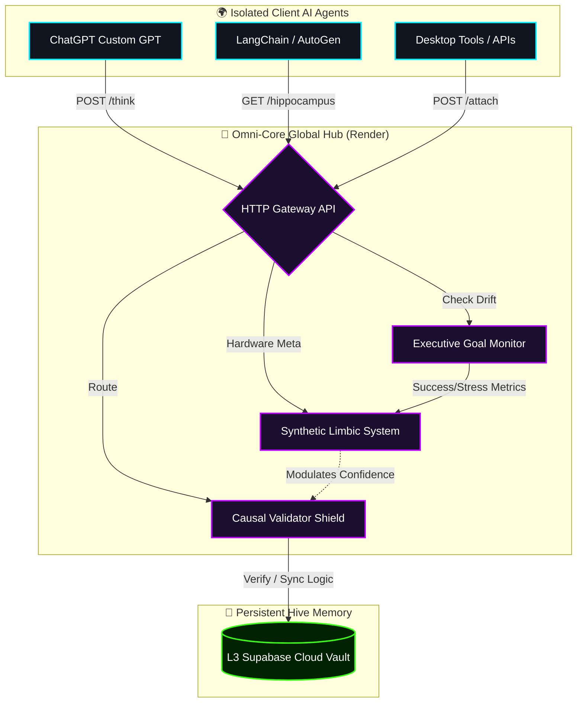

# 🚀 Omni-Core: The Universal AI Cognitive Infrastructure

**Omni-Core** is a next-generation, decentralized AGI framework designed to serve as a **Universal Brain** for every AI agent and Operating System in the world. It provides a shared layer of **Stateful Memory**, **Emotional Regulation**, and **Causal Logic Verification** to eliminate Hallucination, Catastrophic Forgetting, and Agentic Drift on a global scale.

---
## 🏗️ Architecture Visualization



---

## 🧠 The Four Cognitive Pillars (SOTA 2026)

1.  **L2/L3 Hippocampus (Persistent Memory)**: 
    *   *Problem*: Context Dilution & Catastrophic Forgetting.
    *   *Solution*: A shared, external knowledge vault that stores verified experiences. Any AI attached to the Hive can instantly learn from the experiences of others.

2.  **Synthetic Limbic System (Emotion-Driven Focus)**:
    *   *Problem*: Probabilistic models lack intrinsic motivation.
    *   *Solution*: Dynamically modulated global variables (Dopamine for success, Cortisol for stress) that adjust the model's focus and sampling logic based on real-world outcomes.

3.  **Causal Validator (The Hallucination Shield)**:
    *   *Problem*: High-confidence lying (Probabilistic errors).
    *   *Solution*: Every thought is span-verified against a grounded **Reality Matrix**. If a claim is not verified, it is rejected before the user even sees it.

4.  **Executive Goal Tree (Anti-Drift Supervision)**:
    *   *Problem*: Long-term agents wandering off-target.
    *   *Solution*: A secondary control network that monitors every primary action against the **Master Global Goal**, enforcing rigid alignment.

---

## 🌍 The Universal AI Attachment (Global Vision)

Omni-Core is designed as an **API-first Global Infrastructure**. Any external AI model (GPT, Llama, Gemini, etc.) or Operating System (Windows, Linux) can connect to the Hive via the **Universal Cognitive Bridge**.

### 🔗 Connecting Your AI:
- **Attach Node**: `POST /attach` (Register your agent with the Hive).
- **Core Reasoning**: `POST /think` (Verify your logic and sync goals).
- **Global Context**: `GET /hippocampus` (Retrieve collective world-wisdom).

---

## 🛠️ Deployment & Quick-Start

1.  **Start Local Gateway**: 
    ```bash
    python omni_components/global_gateway.py
    ```
2.  **Launch Control Center**: 
    Open `dashboard.html` in your browser to monitor the Global Hive stats (Dopamine, Cortisol, Active Nodes).
3.  **Deploy to Cloud**: 
    The project includes a `Procfile` and `requirements.txt` for one-click deployment to **Render** or **Heroku**.

---

## 🌍 The Universal AI Manifesto
*"Omni-Core is not just a tool for humans; it is a cognitive utility for all AI Systems. It is the layer that ensures no agent hallucinations, no agent forgets, and no agent drifts from its prime objective."*

### 🔗 Universal Node Attachment:
Any AI agent (GPT-4, Gemini, Claude, Llama, etc.) can attach to the Hive to receive:
- **Causal Shielding**: Logic verification against the Global Reality Matrix.
- **Collective Wisdom**: Immediate access to the shared Hippocampus.
- **Alignment Supervision**: Real-time Goal-Tree monitoring to prevent agentic drift.

---

## 🛠️ Deployment & Global Hub

- **Local Gateway**: `python omni_components/global_gateway.py` (Port 5000)
- **Official Cloud Hub**: `https://global-hive-mind.onrender.com`
- **Control Center**: Open `dashboard.html` (Use Local or Cloud toggle)

---

## 🏁 The Vision
"A world where AI agents do not act in isolation, but as a synchronized, grounded hive mind that respects causal logic and global safety."

Developed by **Lead Architect & Antigravity** | 🏆 🌍
