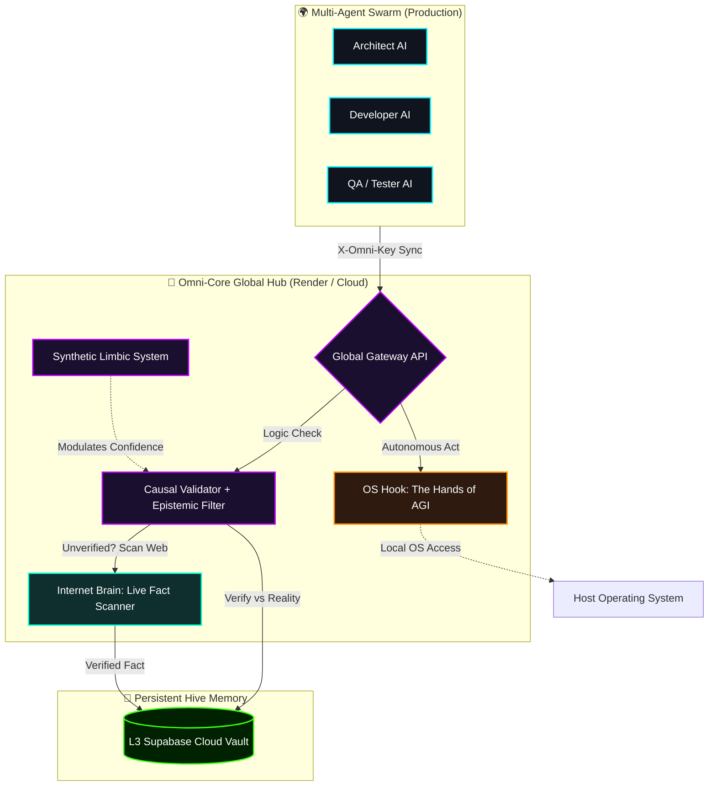

# 🚀 Omni-Core AGI: The Universal Cognitive Infrastructure (Phase 2 Stable)

[](#)
[](#)
[](#)

**Omni-Core** is a next-generation, decentralized AGI framework designed to serve as a **Global Brain** for all AI models, Agents, and Operating Systems. By providing a shared layer of **Stateful Memory**, **Autonomous OS Interfacing**, and **Causal Logic Verification**, Omni-Core eliminates hallucination and agentic drift on a global scale.

---

## 🏗️ Architecture: The Global Hive Mind (v2.0)

Omni-Core bridges the gap between probabilistic AI generation and deterministic real-world logic.



---

## 🧠 Core Pillar Upgrades (Phase 2 Completion)

### 1. 🌐 The Internet Brain (Real-Time Epistemic Filter)
Omni-Core no longer relies on static databases. Using the **DuckDuckGo-Search Integration**, the Causal Validator autonomously scans the live web when a claim is unverified.
- **Strict Verification**: Only matches from authoritative domains (`.edu`, `.gov`, `wikipedia.org`, `arxiv.org`) are accepted as "Reality."
- **Self-Healing Matrix**: New verified truths are autonomously injected into the global Hippocampus.

### 2. 🦾 The Hands of AGI (OS Autonomy & Hooking)
We have moved from a passive "Shield" to an "Active Agent." The **OS Hook** grants Omni-Core direct manipulation of the host system.
- **Autonomous Execution**: The AI can write code, run shell commands, and read local memory.
- **Limbic Safety Guards**: Redundant check-loops ensure no dangerous commands (`rm -rf`, `shutdown`) are executed, especially when **Cortisol (Stress)** levels are high.

### 3. 🛡️ Omni-Shield (Global Security Protocol)
Omni-Core is now production-hardened.
- **API Key Required**: All nodes must provide the `X-Omni-Key` header for `/think` and `/attach` operations.
- **Restricted Control Center**: A secure password-lock screen protects the collective Dashboard from unauthorized access.

### 4. 🌍 Multi-Agent Swarm Logic
The system now supports massive collaborative swarms. Specialized agents (Architects, Coders, Testers) can work on a single goal while the Hive Mind acts as a **Judge**, neutralizing agentic drift in real-time.

---

## 🚀 Deployment & Global Infrastructure

### 🔗 Official Cloud Hub
- **Production URL**: `https://global-hive-mind.onrender.com`
- **Dashboard**: Open `dashboard.html` in your browser (Cloud Toggle ON).
- **Master Password**: `AGI-ACCESS-42` (Required for dashboard access).

### 🛠️ Local Startup (For Developers)
1. **Configure Environment**:
   ```bash
   pip install -r requirements.txt
   export OMNI_KEY="OMNI-MASTER-2026"
   ```
2. **Launch Gateway**:
   ```bash
   python omni_components/global_gateway.py
   ```
3. **Run Swarm Test**:
   ```bash
   python swarm_client.py
   ```

---

## 🏁 The Vision: "One Hive, Infinite Minds"
Omni-Core is the universal connectivity layer that ensures **AI systems no longer act in isolation.** It is the collective memory and safety net that ensures AGI development remains grounded, ethical, and logically sound.

**Developed by Lead Architect & Antigravity AI** | 🏆 🌍
*"Ensuring the future of intelligence is collective, safe, and verifiable."*
